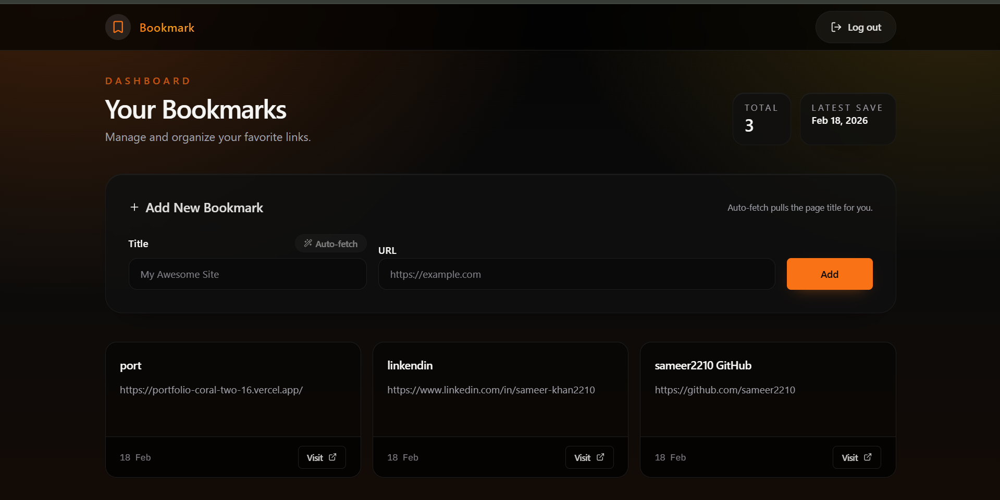

# Abstrabit Bookmark

A fast, focused bookmark manager built with Next.js, Supabase, and Tailwind CSS.

## Project Perspective

I wanted a clean, modern space to save links quickly and find them later without clutter. The UI is intentionally minimal and dark, with a strong focus on readability and speed. The goal: make saving links feel instant and revisiting them feel effortless.

## Features

- **Authentication**: Secure Google OAuth login via Supabase.
- **Bookmarks**: Add, delete, and view your personal bookmarks.
- **Optimistic UI**: Instant updates for a snappy user experience.
- **Real-time Sync**: Changes reflect immediately across all devices.
- **Smart Fetch**: Automatically fetches page titles from URLs.
- **Responsive Design**: Beautiful UI that works on mobile and desktop.


## Problems Faced During Development (and How I Solved Them)

1. Supabase OAuth redirect mismatch

So basically when you click "Sign in with Google," Google authenticates you and then needs to send you back to your app at a specific URL. The problem was that the URL I had set in Supabase and the URL Google was actually trying to redirect to didn't match — even a small difference like a trailing slash or wrong domain would cause it to just fail silently or throw an error. The fix was making sure the callback URL (/auth/callback) was exactly the same everywhere — in the Supabase dashboard, in the Google Cloud Console, and in the code. Then I tested it both locally and on the deployed version because they're different URLs and both need to be registered.

2. RLS policies blocking reads and writes

Supabase uses Row Level Security by default, which means even if your database has data, users literally can't see or touch it unless you explicitly write rules saying they can. I ran into this where bookmarks just weren't showing up, and new ones weren't saving — no real error, just nothing happening. Turns out the RLS policies weren't set up. I had to go in and write rules that said "a user can only select, insert, or delete rows where the user_id matches their own auth ID." Once those were in place and I tested with an actual logged-in user, everything worked.

3. Metadata fetch blocked by some sites

The app automatically tries to grab the title of a webpage when you paste a URL, which is a nice touch. But a lot of  fighting every site's anti-scraping rules, I just made the title fetch a "nice to have." If it works, great — the title gets filled in automatically. If it doesn't, the input just stays empty and the user types the title themselves. No crash, no broken experience.

4. Realtime duplicates after optimistic updates

This one was a classic timing bug. When you add a bookmark, I immediately show it in the UI before the server even responds — that's the "optimistic" part, it feels instant. But the app is also listening to Supabase Realtime for any new data. So when the server confirms the insert, Realtime fires an event and the app tries to add the same bookmark again, ending up with two copies. The fix was simple: before adding anything from the Realtime stream, check if a bookmark with that same id already exists in the list. If it does, skip it. Duplicates gone.


## Tech Stack

- **Framework**: Next.js 16 (App Router)
- **Database**: Supabase (PostgreSQL)
- **Styling**: Tailwind CSS
- **Icons**: Lucide React
- **Animations**: Framer Motion
- **Utilities**: Cheerio (Metadata fetching), Sonner (Toasts)


## Environment Variables

Create a `.env.local` file in the root directory:

```env
NEXT_PUBLIC_SUPABASE_URL=your_supabase_url
NEXT_PUBLIC_SUPABASE_ANON_KEY=your_supabase_anon_key
```

## Dashboard Preview



## Getting Started

1. Install dependencies:
   ```bash
   pnpm install
   ```

2. Run the development server:
   ```bash
   pnpm dev
   ```

3. Open [http://localhost:3000](http://localhost:3000) with your browser.

## Database Setup

Run the SQL commands in `init.sql` in your Supabase SQL Editor to set up the database schema and Row Level Security (RLS) policies.

## Deploy on Vercel

1. **Push to GitHub**: Commit your changes and push to a GitHub repository.
2. **Import Project**: Go to Vercel and import the project.
3. **Environment Variables**: Add `NEXT_PUBLIC_SUPABASE_URL` and `NEXT_PUBLIC_SUPABASE_ANON_KEY` in the Vercel project settings.
4. **Deploy**: Click deploy and wait for the build to finish.
